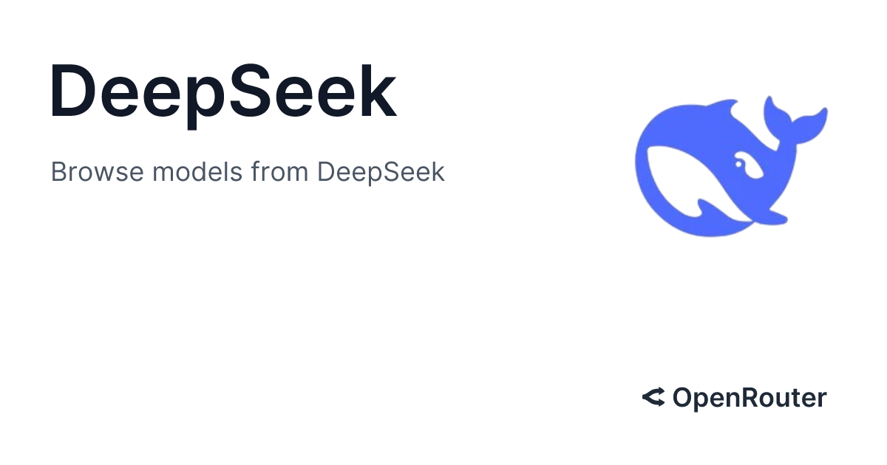

<div style="text-align: center" align="center">

</div>

# Chat-Deepseek

Using Deepseek API through Open Router

## Create a virtual environment

Create a virtual environment in your project folder to keep new packages isolated from the python's system packages.

```
python -m virtualenv env
.\env\Scripts\activate
```

## Install dependancies

### Install ```requests``` for making http requests.

```
pip install requests
```

### Install ```dotenv``` for loading environment variables

This step is optional, but as a best practice, it is recommended to securely store the API key.

```
pip install python-dotenv
```

## Model API

## Getting model's API

Get the API from any models. [Openrouter](https://openrouter.ai/) is an option from where free models can be used.

### Storing the API model securely

This is the optional step if ```python-dotenv``` is installed and if the API doesn't want to be explicitly mentioned to avoid misuse.

- Create a ```.env``` file in the project folder.
- This could be from PowerShell if preferred, using ```New-Item .env -value '"API_KEY = "paste_API_KEY_here"'```

## Setup and Configuration

### Import necessary libraries

```
import requests
import json
import os
from dotenv import load_dotenv
```

### Loading the API key

```
load_dotenv()
API_KEY = os.getenv("API_KEY") 
```
This will load the ```API_KEY``` part stored in the ```.env``` file. If the name used to store the key in ```.env``` is different, please use that name in ```getenv()```.

If you do not want to use ```dotenv``` method, you may explicitly mention the API key in the program as

```
API_KEY= "paste_API_KEY_here"
```

## Core function

```
def get_response(prompt):
    headers = {
        "Authorization": f"Bearer {API_KEY}",
        "Content-Type": "application/json"
    }
    
    payload = {
        "model": "deepseek/deepseek-r1-distill-llama-8b",
        "messages": [{"role": "user", "content": prompt}],
        "max_tokens": 300
    }
    
    try:
        response = requests.post(
            "https://openrouter.ai/api/v1/chat/completions",
            headers=headers,
            data=json.dumps(payload)
        )
        return response.json()["choices"][0]["message"]["content"]
        
    except Exception as e:
        return f"Error: {str(e)}"
```

## Continuous chat interface

This will prompt for user input to which the model will respond. Unless the input is **exit**, the chat will continue in an infinite loop.

```
print("Zenyx HTZ Support (Type 'exit' to quit)")
while True:
    user_input = input("\nYou: ")
    
    if user_input.lower() == 'exit':
        print("Zenyx: Goodbye!")
        break
        
    print("Zenyx: ", end='', flush=True)
    response = get_response(user_input)
    print(response)
```
